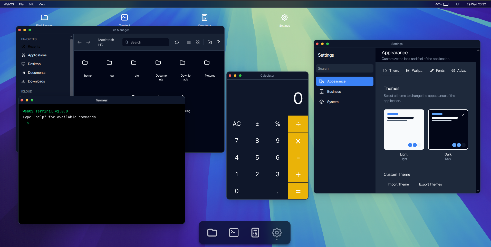

# 🌐 WebOS - Modern Web-Based Operating System

<div align="center">




**A complete web-based operating system with modular, plugin-based architecture built with modern web technologies**

🌐 **[Try the Live Demo](https://openwebos.netlify.app/)**

[](https://opensource.org/licenses/MIT)
[](https://www.typescriptlang.org/)
[](https://www.solidjs.com/)
[](https://vitejs.dev/)

</div>

## ✨ Features

### 🖥️ Desktop Environment
- **Multi-Window Interface**: Full desktop experience with draggable, resizable windows
- **Taskbar & Dock**: Complete desktop navigation with app launcher and system tray
- **Window Management**: Minimize, maximize, snap-to-screen, and z-index management
- **Desktop Icons**: Customizable desktop with shortcuts to applications
- **Alt+Tab Navigation**: Switch between running applications

### 🏗️ Core Architecture
- **Plugin-Based System**: Modular architecture with pluggable applications
- **Event-Driven**: Robust event bus for inter-application communication
- **Multi-Window Support**: Dedicated windows for different applications and tasks
- **Finite State Machine**: Deterministic state management for all subsystems
- **Real-time Communication**: Built-in support for multi-tab synchronization
- **TypeScript-First**: Full type safety across the entire operating system

### 🔧 Core Systems
- **Authentication & Permissions**: Role-based access control
- **Configuration Engine**: Dynamic configuration management
- **Storage Abstraction**: Unified storage interface
- **Theme Engine**: Customizable theming system
- **Internationalization**: Multi-language support
- **Telemetry**: Usage analytics and monitoring
- **Local Cache**: Optimized data caching

### 🔌 External Integrations
- **💾 Storage**: Local and cloud storage providers
- **🖨️ Printers**: Print driver support for various printers
- **📢 Notifications**: Real-time alerts and messaging
- **🌐 Network**: Network and connectivity adapters
- **🔐 Security**: Authentication and security service integrations

## 🚀 Getting Started

### Prerequisites
- Node.js 18+
- Bun (recommended) or npm/yarn

### Installation

```bash
# Clone the repository
git clone https://github.com/devmaaa/webos.git
cd webos

# Install dependencies
bun install

# Start development server
bun run dev
```

The WebOS will be available at `http://localhost:3200`

### Build for Production

```bash
# Build the application
bun run build

# Preview the production build
bun run serve
```

## 🏛️ Architecture Overview

WebOS follows a **microkernel architecture** with **Feature-Sliced Design (FSD)** principles, creating a complete, modular web-based operating system.

### Core Philosophy
- **Microkernel Extensibility**: Core + Plugins with schema-driven configuration
- **Isolation by Design**: Scoped event communication and plugin boundaries
- **Event-Driven Communication**: Deterministic, leak-free messaging via EventBus
- **Offline-First**: Real-time sync with local cache capabilities
- **TypeScript-First**: Full type safety across the entire system

### Macro Architecture

```
┌────────────────────────────────────────────┐
│                WebOS Core                 │
│────────────────────────────────────────────│
│ 🧠 Microkernel                             │
│  • Plugin Loader                           │
│  • Event Bus (Scoped + Leak-safe)          │
│  • Window Manager                          │
│  • Finite State Machine (FSM) System       │
│  • State Manager                           │
│  • Config Engine                           │
│  • Theme Engine                            │
│  • Auth & Permission Layer                 │
│  • Storage Abstraction (Offline + Sync)    │
│                                            │
│ 🔌 Core Services                           │
│  • Notification Service                    │
│  • Sync & Queue Manager                    │
│  • Diagnostics / Telemetry                 │
│  • Cross-tab / Cross-window bridge         │
└────────────────────────────────────────────┘
▲
│
┌──────────────┴──────────────┐
│          Applications       │
│─────────────────────────────│
│ File Manager / Text Editor  │
│ Media Player / Browser      │
│ Terminal / Analytics       │
│ Settings / System Apps     │
└──────────────▲──────────────┘
│
Solid.js Windows (UI)
```

### Directory Structure

```
src/
├── core/                    # Core systems (FSM, EventBus, Window Manager)
├── apps/                    # System applications (File Manager, Terminal, Settings)
├── plugins/                 # Plugin system with modular applications
├── ports/                   # External integrations (DB, Payments, Printers)
└── composables/            # Reusable SolidJS utilities
```

## 🔌 Application Development

WebOS applications follow **Feature-Sliced Design (FSD)** principles. Create a new app by:

1. **Create manifest.json** with app metadata and window configuration
2. **Implement app.tsx** as the main component
3. **Add init.ts** for bootstrap logic and event registration
4. **Register in src/plugins/index.ts**

See existing plugins (Calculator, File Manager, Terminal, Settings) for examples.

### Event System

WebOS uses a **scoped EventBus** for inter-application communication with automatic cleanup:

```typescript
import { eventBus } from '@core/event-bus';

// Emit events
await eventBus.emit('file:created', fileData);

// Listen with scope (auto-cleanup)
const scope = '@webos/my-app';
eventBus.on('file:opened', handler, { scope });
eventBus.offAll(scope); // Cleanup
```

**Event naming**: `domain:action` (e.g., `window:opened`, `file:created`, `app:loaded`)

## 🎨 Theming & Configuration

WebOS supports customizable themes and dynamic configuration. See core/themes/ and core/config-engine/ for implementation details.

## 📊 Development

### Technology Stack
- **Frontend**: SolidJS + TypeScript
- **Build Tool**: Vite
- **Styling**: Tailwind CSS v4
- **Package Manager**: Bun (recommended)
- **Architecture**: Microkernel + Feature-Sliced Design (FSD)

### Commands
```bash
bun run dev      # Start development server
bun run build    # Build for production
bun run serve    # Preview production build
```

## 🤝 Contributing

We welcome contributions! Please see our [Contributing Guide](CONTRIBUTING.md) for details.

### Development Workflow
1. Fork the repository
2. Create a feature branch: `git checkout -b feature/amazing-feature`
3. Make your changes
4. Run tests: `bun test`
5. Commit your changes: `git commit -m 'Add amazing feature'`
6. Push to the branch: `git push origin feature/amazing-feature`
7. Open a Pull Request

## 📄 License

This project is licensed under the MIT License - see the [LICENSE](LICENSE) file for details.

## 🙏 Acknowledgments

- [SolidJS](https://www.solidjs.com/) - Reactive UI library
- [Vite](https://vitejs.dev/) - Build tool and dev server
- [Tailwind CSS](https://tailwindcss.com/) - Utility-first CSS framework

## 📞 Support

- 📧 Email: support@webos.com
- 💬 Discord: [Join our community](https://discord.gg/webos)
- 📖 Documentation: [docs.webos.com](https://docs.webos.com)

---

<div align="center">

**Built with ❤️ for the web platform**

[⭐ Star this repo](https://github.com/devmaaa/webos) | [🐛 Report Issues](https://github.com/devmaaa/webos/issues) | [💡 Request Features](https://github.com/devmaaa/webos/discussions)

</div>